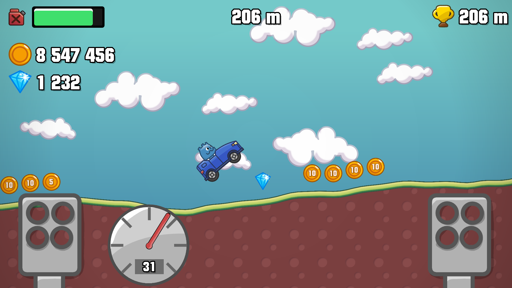
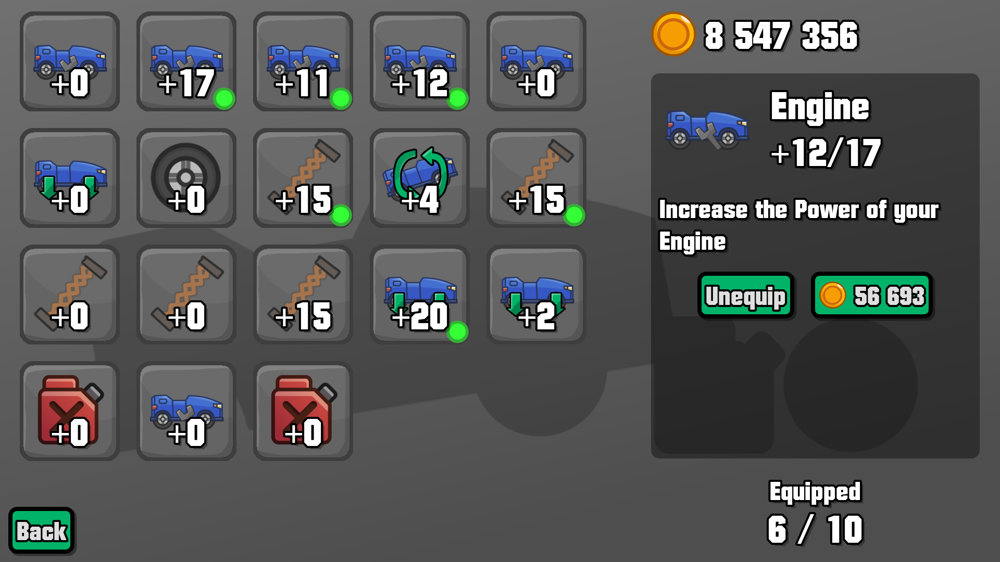

# Hill Climb Driving

This is a Hill Climb Racing Fanmade with **mod**ular upgrades and easy possibility for **mod**ding with its permissive [MIT](./LICENSE) License.

## Credits

### Asset Packs

- [Physics car game asset pack](https://lucylavend.itch.io/physics-car-game-asset-pack)

### Sound Effects

- Sound Effect by [UNIVERSFIELD](https://pixabay.com/de/users/universfield-28281460/?utm_source=link-attribution&utm_medium=referral&utm_campaign=music&utm_content=121580) from [Pixabay](https://pixabay.com//?utm_source=link-attribution&utm_medium=referral&utm_campaign=music&utm_content=121580) (Sped up)
- Sound Effect from [Pixabay](https://pixabay.com/sound-effects/?utm_source=link-attribution&utm_medium=referral&utm_campaign=music&utm_content=87313) (Cropped)
- Sound Effect from [Pixabay](https://pixabay.com/?utm_source=link-attribution&utm_medium=referral&utm_campaign=music&utm_content=33787)
- Sound Effect by [Jurij](https://pixabay.com/de/users/soundreality-31074404/?utm_source=link-attribution&utm_medium=referral&utm_campaign=music&utm_content=160387) from [Pixabay](https://pixabay.com//?utm_source=link-attribution&utm_medium=referral&utm_campaign=music&utm_content=160387)

### Note

- Sound Effects have been normalized
- Credits are available ingame
