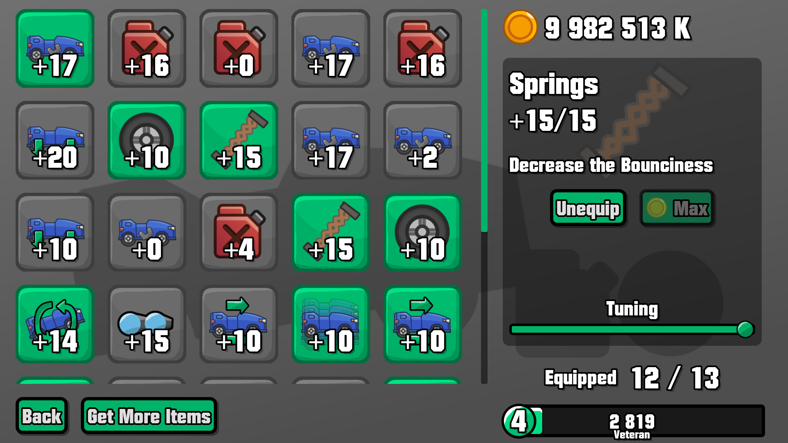
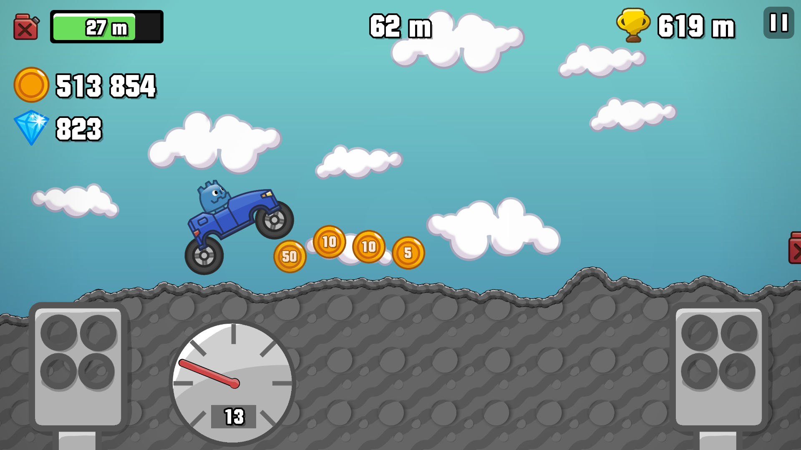

# Hill Climb Driving

This is a Hill Climb Racing Fanmade with **mod**ular upgrades and easy possibility for **mod**ding with its permissive [MIT](./LICENSE) License.

## Credits

### Asset Packs

- [Physics car game asset pack](https://lucylavend.itch.io/physics-car-game-asset-pack)

### Sound Effects

- [buy.ogg](http://freesound.org/people/Benboncan/sounds/91924) by [Benboncan](http://freesound.org/people/Benboncan)
- [fuel.ogg](http://freesound.org/people/teleport8/sounds/28707) by [teleport8](http://freesound.org/people/teleport8)
- [break_neck.ogg](http://freesound.org/people/Halleck/sounds/21914) by [Halleck](http://freesound.org/people/Halleck)
- [colect.ogg](http://freesound.org/people/fins/sounds/146723) by [fins](http://freesound.org/people/fins)
- [equip.ogg](http://freesound.org/people/gelo_papas/sounds/63125) by [gelo_papas](http://freesound.org/people/gelo_papas)
- [beep.ogg](http://freesound.org/people/gmtechb/sounds/49166) by [gmtechb](http://freesound.org/people/gmtechb)
- [engine.ogg](https://freesound.org/people/gladkiy/sounds/332385/) by [gladkiy](http://freesound.org/people/gladkiy)

- Sound Effect(nirvana_ambience.ogg) by [Jurij](https://pixabay.com/de/users/soundreality-31074404/?utm_source=link-attribution&utm_medium=referral&utm_campaign=music&utm_content=160387) from [Pixabay](https://pixabay.com//?utm_source=link-attribution&utm_medium=referral&utm_campaign=music&utm_content=160387)

### Note

- Sound Effects have been normalized
- Credits are available ingame

Portions of the materials used are trademarks and/or copyrighted works of Fingersoft Ltd. All rights reserved by Fingersoft. This material is not official and is not endorsed by Fingersoft.
